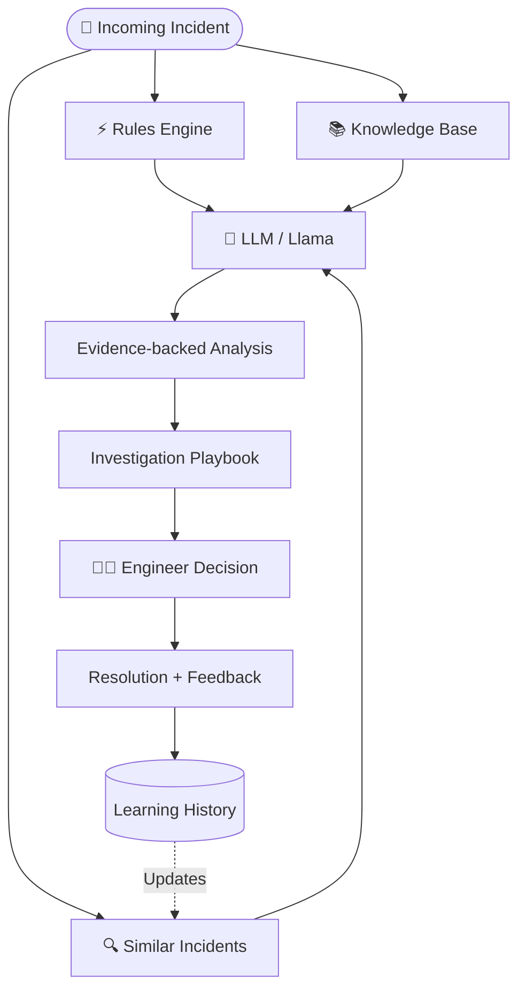

# Architecture

This document describes the high-level architecture of the Digiplus project.

## System Workflow

## Components
1. **Rules Engine**: Deterministic logic for immediate, hardcoded tagging.
2. **Similar Incidents / Learning History**: A vector store (or database) of past resolved tickets used to find historical precedence.
3. **Knowledge Base**: Company documentation, manuals, and standard operating procedures (SOPs).
4. **LLM Engine**: Processes the rule outputs, similar past incidents, and KB articles to generate an evidence-backed analysis and a step-by-step investigation playbook.
5. **Support Engineer**: Reviews the generated playbook and makes the final decision.
6. **Learning History**: A feedback loop where human resolutions are stored back into the database to improve future "Similar Incident" retrieval.
